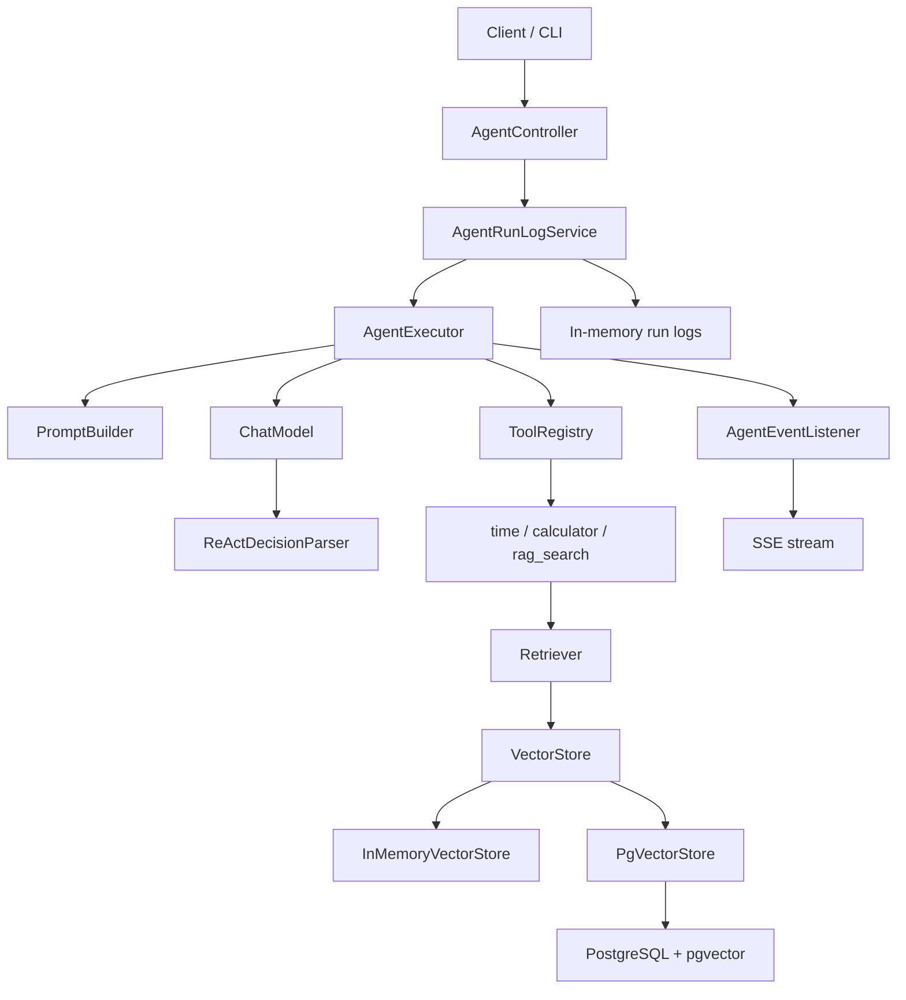

# MiniAgent

MiniAgent is a lightweight Java Agent Runtime built from scratch. It implements a ReAct-style execution loop, tool orchestration, multi-step task execution, RAG retrieval, SSE event streaming, execution logs, unified REST APIs, and Docker-based deployment.

The current model implementation is `RuleBasedChatModel`, which demonstrates the Agent runtime without depending on an external LLM API. The runtime is designed so a real LLM adapter can replace the model layer later.

## Features

- ReAct-style `Thought -> Action -> Observation -> Final Answer` execution loop
- Extensible `Tool` interface and `ToolRegistry`
- Multi-step task execution based on previous observations
- Tool error handling by converting exceptions into observations
- Markdown knowledge base loading from `src/main/resources/knowledge/*.md`
- RAG retrieval with text splitting, fixed-size hash embeddings, topK retrieval, and `rag_search`
- Pluggable `VectorStore` implementations: in-memory and PostgreSQL/pgvector
- SSE event stream for Agent execution status
- Execution logs with run id, duration, final answer, and step details
- Unified REST response format and global exception handling
- Request validation for Agent inputs
- Dockerfile and Docker Compose support

## Architecture



## Core Flow

```text
User Input
  -> PromptBuilder builds the ReAct prompt
  -> ChatModel returns Thought / Action / Action Input
  -> ReActDecisionParser parses the model decision
  -> AgentExecutor calls the selected Tool
  -> Tool result becomes Observation
  -> Agent repeats until Final Answer or max steps
```

Example:

```text
User: tell me the time and calculate 12 + 30

Thought: The user asks for the current time...
Action: time()
Observation: 2026-05-19 17:20:57

Thought: The user asks for an addition calculation...
Action: calculator(12+30)
Observation: 42

Final Answer: Tool time returned: ... Tool calculator returned: 42.
```

## Tech Stack

- Java 17
- Spring Boot 3.3.5
- Spring MVC / SSE
- Spring JDBC
- PostgreSQL
- pgvector
- Maven
- Docker / Docker Compose

## Quick Start

### Build

```powershell
mvn package
```

### Run Web Service

```powershell
mvn spring-boot:run
```

Service address:

```text
http://127.0.0.1:8080
```

### Run CLI Demo

```powershell
javac -encoding UTF-8 -d target/classes (Get-ChildItem -Recurse src/main/java/*.java).FullName
java -cp target/classes com.jagent.App
```

Example CLI inputs:

```text
what time is it
calculate 12 + 30
tell me the time and calculate 12 + 30
MiniAgent knowledge features
```

## API

### List Tools

```text
GET /api/tools
```

### Run Agent

```text
POST /api/agent/run
Content-Type: application/json
```

Request:

```json
{
  "input": "tell me the time and calculate 12 + 30"
}
```

Response:

```json
{
  "code": 0,
  "message": "success",
  "data": {
    "runId": "...",
    "success": true,
    "finalAnswer": "...",
    "durationMs": 10,
    "steps": []
  }
}
```

### Stream Agent Events

```text
GET /api/agent/stream?input=calculate%2012%20%2B%2030
```

SSE event types:

```text
started
thinking
tool_calling
observation
finished
failed
```

### Query Run Logs

```text
GET /api/runs
GET /api/runs/{runId}
```

Run logs include:

```text
runId
userInput
success
finalAnswer
startedAt / finishedAt / durationMs
steps[index, thought, toolName, toolArguments, observation, durationMs]
```

## Unified Response

Normal REST APIs use:

```json
{
  "code": 0,
  "message": "success",
  "data": {}
}
```

Errors use the same shape:

```json
{
  "code": 400,
  "message": "input must not be blank",
  "data": null
}
```

The SSE endpoint keeps the `text/event-stream` format and is not wrapped by `ApiResponse`.

## RAG

RAG pipeline:

```text
Markdown files
  -> KnowledgeBaseLoader
  -> Document
  -> TextSplitter
  -> DocumentChunk
  -> SimpleEmbeddingModel
  -> VectorStore
  -> Retriever
  -> rag_search Tool
  -> Agent Observation
```

Knowledge base files live in:

```text
src/main/resources/knowledge/
```

Current embedding implementation:

```text
SimpleEmbeddingModel: fixed-size 128-dimensional hash embedding
```

Vector stores:

- `InMemoryVectorStore`
- `PgVectorStore`

## PostgreSQL + pgvector

Start pgvector:

```powershell
docker compose up -d mini-agent-db
```

Initialization SQL:

```text
docker/postgres/init.sql
```

Run Web service with pgvector:

```powershell
mvn spring-boot:run "-Dspring-boot.run.arguments=--miniagent.rag.store=pgvector"
```

Relevant config:

```properties
miniagent.rag.store=in-memory
miniagent.rag.top-k=3
miniagent.rag.chunk-size=500
```

## Docker

Build image:

```powershell
docker build -t mini-agent .
```

Run container:

```powershell
docker run --rm -p 8080:8080 mini-agent
```

## Project Highlights

- Implemented an Agent runtime instead of only wrapping an LLM API.
- Designed a ReAct execution loop with explicit decisions, tool calls, observations, and final answers.
- Built a pluggable tool system with error observations and tool description rendering.
- Added SSE execution events for real-time Agent state streaming.
- Implemented execution logging for debugging and run history inspection.
- Built a RAG retrieval pipeline from Markdown loading to pgvector search.
- Decoupled retrieval storage through `VectorStore`, supporting both memory and PostgreSQL/pgvector backends.

## Resume Description

MiniAgent is a lightweight Java Agent Runtime based on Spring Boot. It supports ReAct-style multi-step execution, tool orchestration, RAG retrieval, SSE event streaming, execution logs, unified REST APIs, and Docker deployment. The RAG module loads Markdown knowledge base documents, splits text into chunks, generates fixed-size embeddings, and supports both in-memory retrieval and PostgreSQL/pgvector retrieval through a pluggable `VectorStore` interface.
